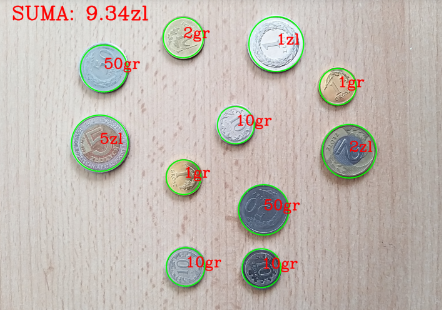

## Human-Computer Interaction Project

Detection and classification of coins and banknotes. The application calculates the amount of money shown in the photo. Project created for Human-Computer Interaction classes.

### Project created by:

* [@ColdBacon](https://github.com/ColdBacon)
* [@JoachimMakowski](https://github.com/JoachimMakowski)
